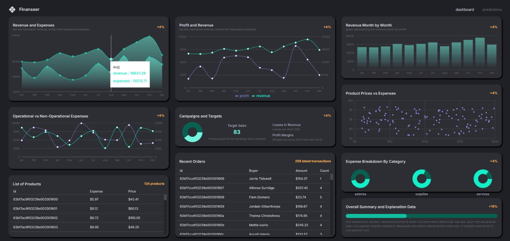
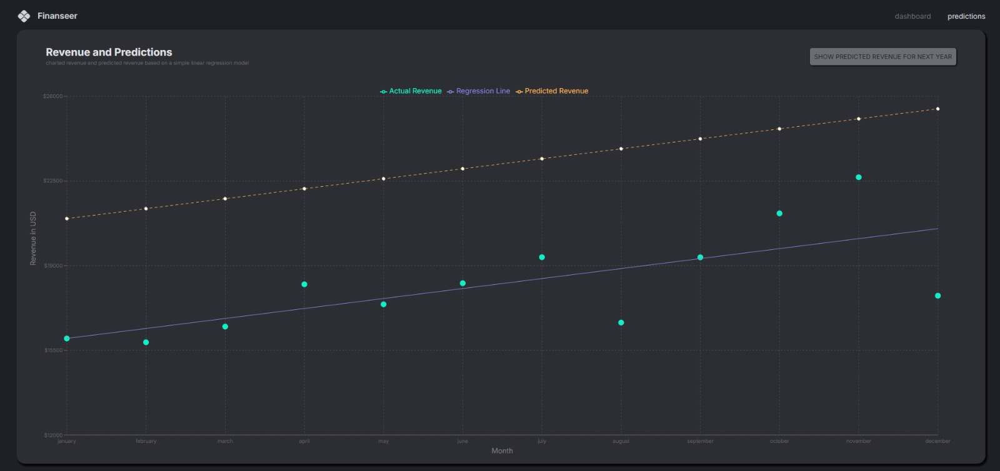

# 🚀 FinBoard — Modern Finance Dashboard

A sleek, data-driven **finance analytics dashboard** built with the MERN stack — designed to visualize business performance, track transactions, and deliver actionable insights in real time.

---

## ✨ Live Preview

🌐 **Frontend**: https://finboard-pro-xi.vercel.app/
⚙️ **API**: https://finboard-pro-4.onrender.com/

---

## 🖼️ Product Snapshot

<p align="center">
  
</p>

<p align="center">
  
</p>

## 🧠 What This Project Solves

Most beginner dashboards just display static data.

**FinBoard goes further:**

* Structures real-world financial data
* Simulates business KPIs & transactions
* Visualizes trends through interactive charts
* Demonstrates scalable frontend-backend architecture

---

## ⚙️ Tech Stack

**Frontend**

* React (Vite + TypeScript)
* Material UI
* Redux Toolkit Query
* Recharts

**Backend**

* Node.js + Express
* MongoDB + Mongoose

---

## 🏗️ Architecture

```bash
client/   → UI + state management  
server/   → API + database logic  
```

* REST API driven
* Modular backend structure
* Centralized state with RTK Query
* Responsive UI system

---

## 📊 Core Features

* Real-time KPI analytics
* Transaction tracking system
* Product performance monitoring
* Interactive data visualizations
* Clean, responsive dashboard UI

---

## 🔌 API Overview

| Resource     | Endpoint                    |
| ------------ | --------------------------- |
| KPI          | `/kpi/kpis`                 |
| Products     | `/product/products`         |
| Transactions | `/transaction/transactions` |

---

## ⚡ Local Setup

```bash
git clone https://github.com/Shivamshekharss/finboard-pro.git
cd finboard-pro
```

### Backend

```bash
cd server
npm install
```

Create `.env`

```
MONGO_URL=mongodb://127.0.0.1:27017/finance-dashboard
PORT=5000
```

```bash
npm start
```

---

### Frontend

```bash
cd client
npm install
```

Create `.env`

```
VITE_BASE_URL=http://localhost:5000
```

```bash
npm run dev
```

---

## 🚧 Limitations

* No authentication (single-user simulation)
* Static seeded dataset
* No export/reporting features yet

---

## 🔮 Next Evolution

* JWT Authentication
* Multi-user dashboards
* Advanced filtering & search
* Export (CSV / PDF)
* Dark mode

---

## 🎯 Why This Project Matters

This project demonstrates:

* Full-stack MERN development
* API-driven UI architecture
* Real-world dashboard design patterns
* Clean and scalable code structure

---

## 👨‍💻 Author

**Shivam Shekhar**

---

## ⭐ If You Like It

Give it a star — it helps more than you think.
